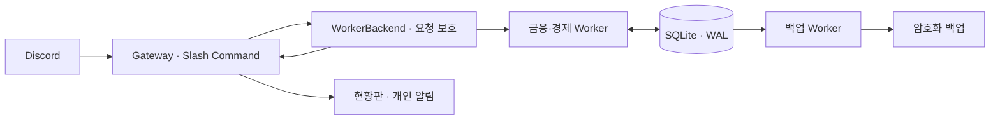

# PaperMarket


[](.node-version)
[](package.json)
[](package.json)
[](src/storage/database.ts)
[](src/discord/commands.ts)

가상 기업의 실적·금리·현금흐름·공시와 시장 기대로 움직이는 **Discord 모의투자 시뮬레이터**입니다. 혼자서도 계좌를 개설하고 투자 판단과 결과를 기록할 수 있습니다. 실제 자금·주식과 연결되지 않습니다.

[소개 페이지 보기](https://papermarket-intro.bryan131.chatgpt.site)

## 구동 아키텍처



금융·경제 Worker가 시장 틱, 주문, 체결과 원장을 단일 작성자·트랜잭션으로 처리합니다. 확정된 결과를 Gateway가 비공개 응답·현황판·개인 알림으로 전달하고, 별도 Worker가 암호화 백업을 수행합니다.

Node.js 24에서 [`.env.example`](.env.example)을 `.env`로 복사해 Discord 설정, 운영자 정보, 계좌 키·시장 시드·백업 키를 입력합니다. 등록과 이용 범위는 설정한 Discord 서버입니다. 자세한 설정·복구 절차는 [운영 안내](docs/OPERATIONS.md)에 있습니다.

```powershell
npm ci --ignore-scripts
npm run config:check
npm run register:commands
npm start
```

## 명령어

| 명령어 | 기능 |
|---|---|
| `/setup channel:#시장` | 서버 관리 권한으로 시장·현황판 설정 또는 복구 |
| `/open age_14_plus:true agree_terms:true` | 확인·동의 후 모의계좌 개설, 최초금 10,000포인트 지급 |
| `/market`, `/status` | 현재 시세·등락률·시장 상태 조회 |
| `/company symbol:HGI` | 기업 개요·시세·공시·배당 조회 |
| `/economy` | 가상 금리·경제지표·정책 전망 조회 |
| `/financial symbol:HGI` | 공개 실적·현금흐름·시장 전망 조회 |
| `/news`, `/calendar` | 공개 공시와 실적·배당·정책 일정 조회 |
| `/chart symbol:HGI` | 원가격·배당 포함 총가치의 PNG 차트 조회 |
| `/buy symbol:HGI quantity:1` | 시장가 또는 지정가 매수 견적 확인 |
| `/sell symbol:HGI quantity:1` | 시장가·지정가·스톱 매도 견적 확인 |
| `/orders` | 본인의 미체결 주문·예약 자산 조회 및 취소 |
| `/portfolio`, `/history` | 본인의 자산·손익과 거래·배당·이자 내역 조회 |
| `/performance` | 총수익·최대낙폭·동일 개설 시점 기준전략 비교 |
| `/alerts` | 관심 종목·가격 알림·알림함·선택 DM 관리 |
| `/export format:CSV` | 본인 기록을 CSV 또는 JSON으로 내보내기 |
| `/help`, `/privacy` | 모의투자 규칙·약관·개인정보 처리 안내 |
| `/close confirmed:true` | 계좌 이용 종료·ID 연결 제거, 금융 기록 보관 |

매매는 견적을 확인한 뒤 확인 버튼으로 확정합니다. 지정가는 `order_type:LIMIT price:950`, 스톱 매도는 `order_type:STOP price:900`을 추가합니다. 개인 계좌·거래·성과 응답은 비공개입니다.

[기술·디자인 백서](docs/PaperMarket_Technical_Whitepaper_KR.md) · [운영 안내](docs/OPERATIONS.md) · [정책 안내](docs/policy/README.md)
